# Wired Assembly

*How to build a cheap **Hotdog**.*

 

If you have access to a 3D printer and use a cheap  
Nano clone with `CH340`, the whole thing will run  
you around `$20`, not counting the sleeve itself.

## Parts

-   Transparent Sleeve

    *I use **[This][Sleeve]** one.*

-   3D Printed

    - **[Bottom Casing]**
    - **[Top Casing]**
    
     
    
-   Arduino Nano

-   2 x Single row 15 pin female header

-   2 x Universal PCB 

    `50mm x 100mm`
    
    Such as:
    
    - **[Amazon][PCB Amazon]**
    - **[Hestore][PCB Hestore]**
    - **[Ormix][PCB Ormix]**
    
     
    
-   5 x `GL5528` Photoresistor

-   3 x `334-15/T1C1-4WYA` LEDs 
    
    *These are actually overkill, you could also*  
    *go with dimmer LEDs and a smaller resistor*
    
-   `1kΩ` resistor

-   Long USB cable 

    *For the Arduino Nano*

-   Mini zip ties

    *Less than `3mm` in width*
    
-   Rubber bands

-   Solder and hook-up wire

 
 

## Programming

Upload the **[Firmware]** to the micro-controller.

*Check out the **[Guide]** if you have never done this.*

 
 

## Assembly

1.  Place the photo-resistors on the **back side** of the  
    PCB at equal distances along the middle line.

    The exact distance between them is not that  
    important, but try to place them evenly.
    
    Solder them in position.
    
    *This is easier if your PCB is plated on both sides, if it  
    isn't, then take extra care not to burn the photocells.*

    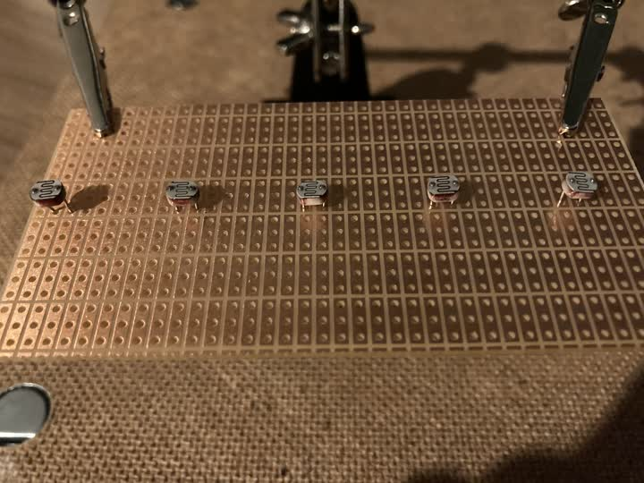
    
     

2.  Wire up the photocells as shown diagram, except  
    with the wires on the **front side** of the board.
    
    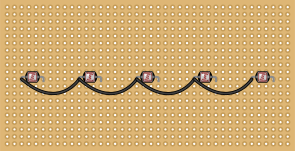

    The front side should look something like this:
    
    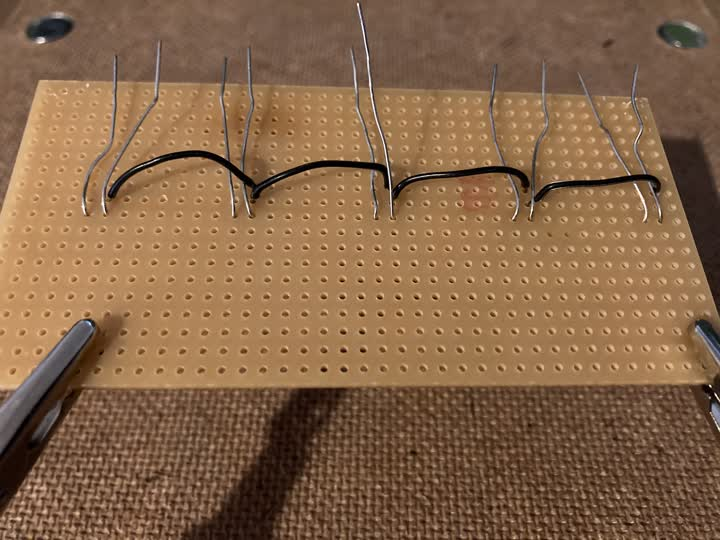
    
     

3.  Put the sockets on the Nano and solder them  
    onto the board in the below orientation.

    *Leave at least one row space at the top ↓*

    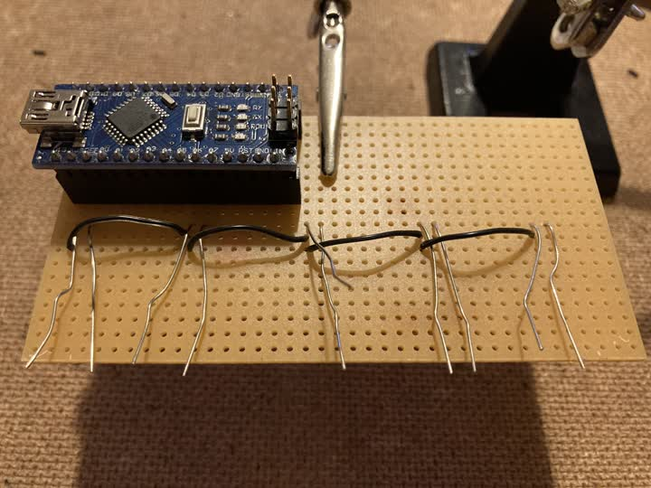

    You don't have to solder each and every pin  
    in, but at the bare minimum, do the corners.
    
    Make sure you don't solder any adjacent pins together.
    
     

4.  Now connect the photocells to the  
    Nano according to the diagram.

    ***Do NOT solder the wires directly onto***  
    ***the Nano, solder them to the sockets.***
    
    *I couldn't find a way to illustrate this in*  
    *Fritzing, so also see the photo for reference.*

    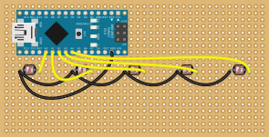
    
    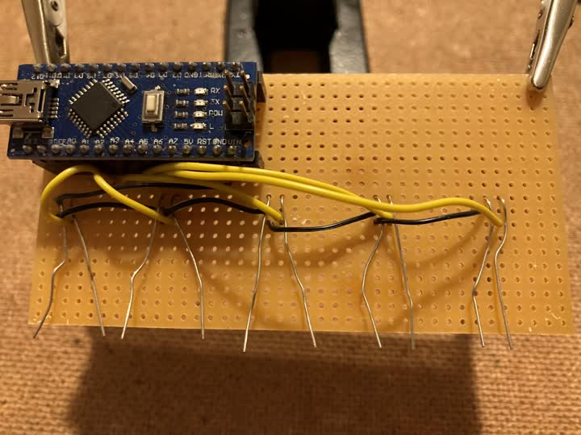

    After the photocells are connected, you can trim off all the legs.
    
     

5.  Mount the LEDs on the second PCB and  
hook them up to the Nano to each other.
    
    *Black wire to cathodes.*

    Don't forget the resistor.
    
    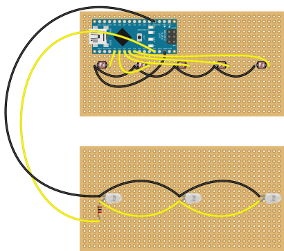

    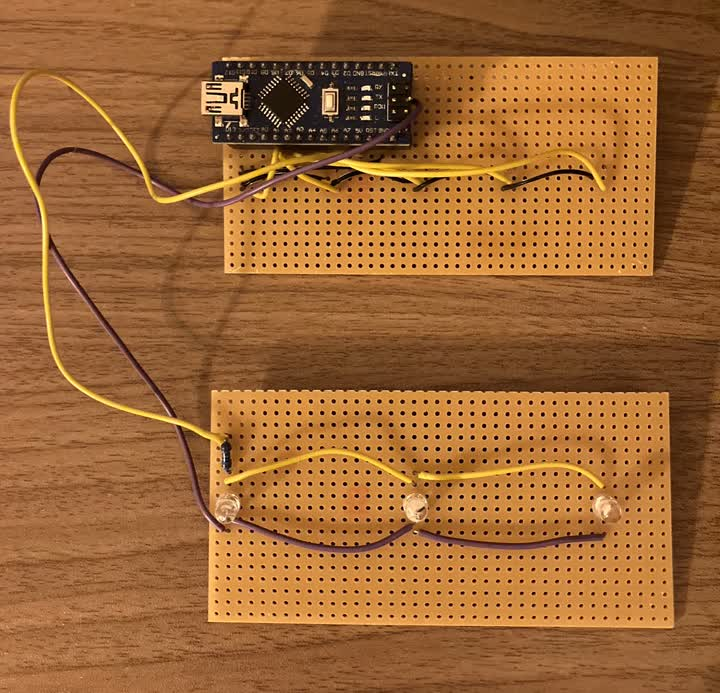

     

6.  Tie the casings together at the back with zip-ties.

    Leave them loose and don't tighten them until the sleeve is in.

    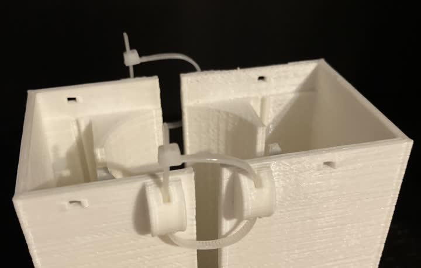

     

7.  Slide the PCBs in, secure each with a zip-tie  
    and the clipped off end of another zip-tie.
    
    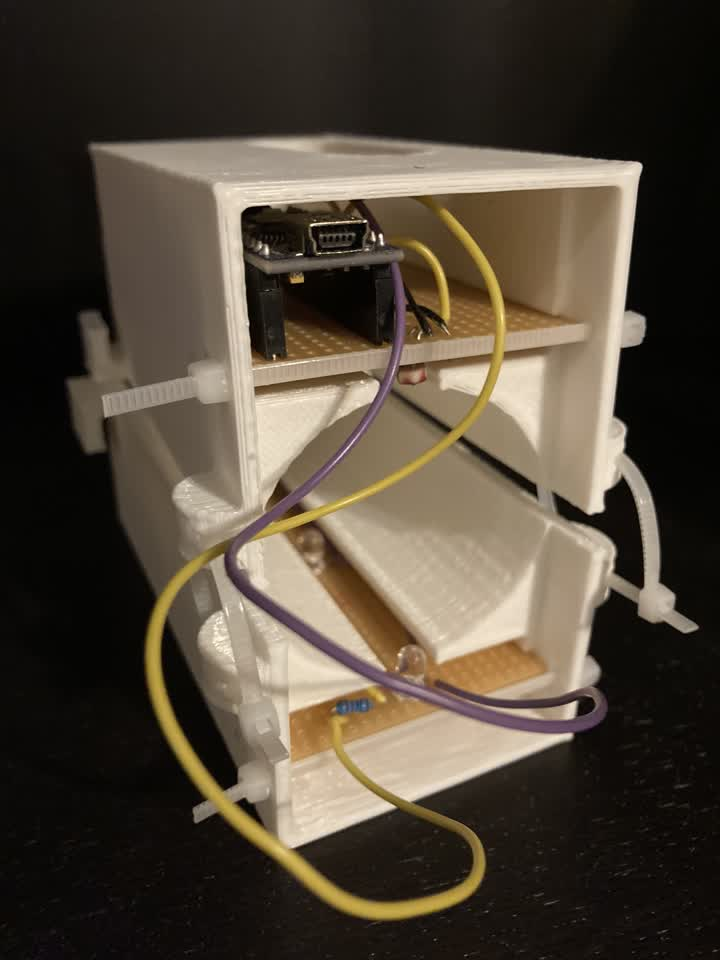
    
     

8.  Add the sleeve, hold it down with rubber bands  
    at the front and tighten the zip-ties at the back.

    *Make sure all sides of the casing press down on the sleeve evenly.*

    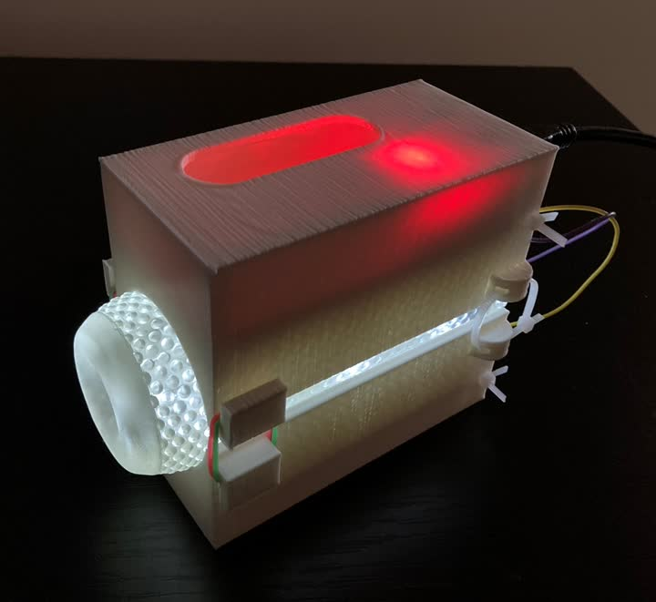

     

9.  Serve hot.

 

<!----------------------------------------------------------------------------->

[Firmware]: https://github.com/Sauceke/hotdog/releases/latest/download/hotdog-fw.ino

[Guide]: https://docs.arduino.cc/software/ide-v1/tutorials/getting-started/cores/arduino-avr

<!---------------------------------[ Parts ]----------------------------------->

[Sleeve]: https://www.thehandy.com/product/the-handy-open-ended-sleeve-collection-hard-eu-uk-2/?ref=saucekebenfield&utm_source=saucekebenfield&utm_medium=affiliate&utm_campaign=The%20Handy%20Affiliate%20program

[Bottom Casing]: https://github.com/Sauceke/hotdog/releases/latest/download/hotdog-case-bottom.stl
[Top Casing]: https://github.com/Sauceke/hotdog/releases/latest/download/hotdog-case-top.stl

[PCB Hestore]: https://www.hestore.hu/prod_10031793.html?lang=en
[PCB Amazon]: https://www.amazon.de/-/en/WITTKOWARE-Perforated-Compartments-Copper-RM2-54/dp/B07W8H39TR
[PCB Ormix]: https://ormix.lv/en/catalog/item/id/21692/))

