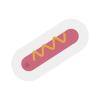

# Hotdog

*A pocket pussy with depth sensing.*

 

---

[![Button Demo]][Demo]   
[![Button Firmware]][Firmware]   
[![Button PCB & Case]][PCB & Case]

---

 
 

## Assembly

*How to build this project.*

[![Button Wireless]][Wireless]   
[![Button Wired]][Wired]

 
 

## Acknowledgment

Thanks to **[@ManlyMarco]** for the idea.

 

<!----------------------------------------------------------------------------->

[@ManlyMarco]: https://github.com/ManlyMarco
[Demo]: https://www.erome.com/a/rvRyi8gS

[License]: LICENSE
[PCB & Case]: https://github.com/Sauceke/hotdog/tree/master/Source/Hardware
[Firmware]: https://github.com/Sauceke/hotdog/tree/master/Source/Firmware
[Wireless]: Documentation/Wireless.md
[Wired]: Documentation/Wired.md

<!---------------------------------[ Badges ]---------------------------------->

[Badge License]: https://img.shields.io/badge/License-GPL_3-blue.svg?style=for-the-badge

<!--------------------------------[ Buttons ]---------------------------------->

[Button PCB & Case]: https://img.shields.io/badge/PCB_&_Case-3863A0?style=for-the-badge&logoColor=white&logo=Task
[Button Firmware]: https://img.shields.io/badge/Firmware-00979D?style=for-the-badge&logoColor=white&logo=Arduino
[Button Wireless]: https://img.shields.io/badge/Wireless-006643?style=for-the-badge&logoColor=white&logo=RSS
[Button Wired]: https://img.shields.io/badge/Wired-2D50A5?style=for-the-badge&logoColor=white&logo=EquinixMetal
[Button Demo]: https://img.shields.io/badge/NSFW_Demo-ED2761?style=for-the-badge&logoColor=white&logo=Aparat
