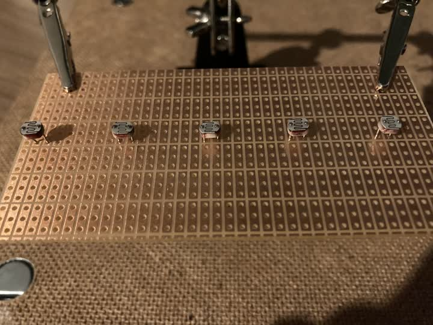
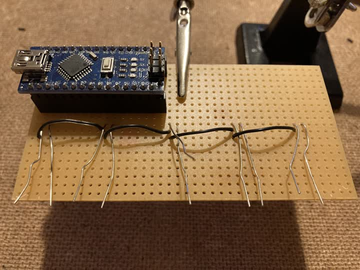
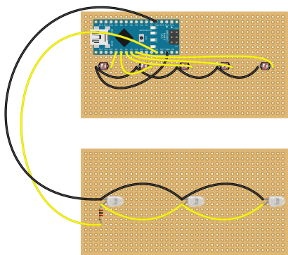
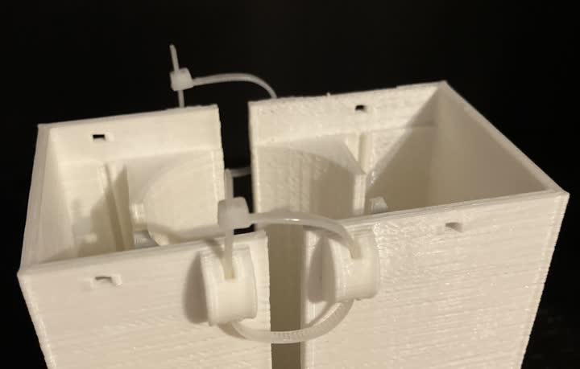
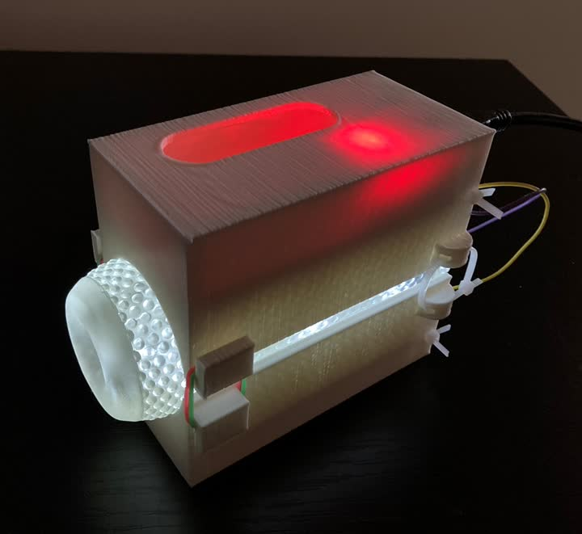

# How to make a Hotdog (cheapest version)

## Parts
Here are all the parts you'll need. If you have access to a 3D printer and use a cheap Nano clone with CH340, the whole thing will run
you around $20, not counting the sleeve itself.
- A transparent sleeve (I used [this one](https://www.thehandy.com/product/open-ended-sleeve-hard/?ref=saucekebenfield&utm_source=saucekebenfield&utm_medium=affiliate&utm_campaign=The%20Handy%20Affiliate%20program))
- A 3D print of [this](https://github.com/Sauceke/hotdog/releases/latest/download/hotdog-case-top.stl)
- A 3D print of [this](https://github.com/Sauceke/hotdog/releases/latest/download/hotdog-case-bottom.stl)
- 1x Arduino Nano
- 2x single row 15 pin female header
- 2x universal PCB, 50mm×100mm (something like [this](https://www.amazon.de/-/en/WITTKOWARE-Perforated-Compartments-Copper-RM2-54/dp/B07W8H39TR),
[this](https://www.hestore.hu/prod_10031793.html?lang=en) or [this](https://ormix.lv/en/catalog/item/id/21692/))
- 5x GL5528 photoresistor
- 3x 334-15/T1C1-4WYA LEDs (these are actually overkill, you could also go with dimmer LEDs and a smaller resistor)
- 1x 1kΩ resistor
- A long USB cable (for the Nano)
- Mini zip ties (less than 3mm in width)
- Rubber bands
- Solder and hook-up wire, duh

## Programming
Upload [this sketch](https://github.com/Sauceke/hotdog/releases/latest/download/hotdog-fw.ino) to the Nano. If you've never done this before, [here is how you upload a sketch](https://docs.arduino.cc/software/ide-v1/tutorials/getting-started/cores/arduino-avr) in Arduino IDE 1.

## Assembly
1. Place the photoresistors on the **back side** of the PCB at equal distances along the middle line. The exact distance between them is
not that important, but try to place them evenly. Solder them in (this is easier if your PCB is plated on both sides, if it isn't, then
take extra care not to burn the photocells).

2. Wire up the photocells like this, except the wires should run on the **front side** of the PCB.

The front side should look something like this:

3. Put the sockets on the Nano and solder them onto the board in the below orientation. Leave at least one row space at the top (as shown in the next diagram).

You don't have to solder each and every pin in, but at the bare minimum, do the corners. Make sure you don't solder any adjacent pins together.

4. Now connect the photocells to the Nano according to the following diagram. Do NOT solder the wires directly onto the Nano, solder them
to the sockets (I couldn't find a way to illustrate this in Fritzing, so also see the photo for reference).

After the photocells are connected, you can trim off all the legs.

5. Mount the LEDs on the second PCB and hook them up to the Nano and each other according to this diagram (black wire to cathodes). Don't forget the resistor.

6. Tie the casings together at the back with zipties. Leave them loose; don't tighten them until the sleeve is in.

7. Slide the PCBs in and secure each with a ziptie and the clipped off end of another ziptie.

8. Add the sleeve, hold it down with rubber bands at the front, and tighten the zipties at the back. Make sure all sides of the casing press down on the sleeve evenly.

9. Serve hot.
