# How to make a Hotdog (wireless version)

## Parts list

> 

### Custom parts
3D print the following modules:
- 1x [`hotdog-case-top`](https://github.com/Sauceke/hotdog/releases/latest/download/hotdog-case-top.stl)
- 1x [`hotdog-case-bottom`](https://github.com/Sauceke/hotdog/releases/latest/download/hotdog-case-bottom.stl)

Order the following items from a PCB fabrication service (estimated cost: 10-20 USD each):
- 1x [`hotdog-pcb-front`](https://github.com/Sauceke/hotdog/releases/latest/download/hotdog-pcb-front-fab.zip),
size: 100x50mm, layers: 2, thickness: 1.6mm, solder mask: yes, HASL: yes
- 1x [`hotdog-pcb-back`](https://github.com/Sauceke/hotdog/releases/latest/download/hotdog-pcb-back-fab.zip),
size: 100x50mm, layers: 2, thickness: 1.6mm, solder mask: yes, HASL: yes

### Stock parts
⚠ For the USB connected version, only parts `A1`, `D1-D3`, `R1-R6` and `J1-J4` are required (highlighted below).

- **`A1`: Arduino Nano (a Nano Every also works) + two 1x15 pin female headers**
- `BT1`: a 1xAAA battery holder (thru-hole mount recommended)
- `C1`: a 10-100uF capacitor (optional)
- `C2`: a ~1000uF capacitor (optional)
- **`D1-D3`: three white LEDs (I used 334-15/T1C1-4WYA)**
- **a 12cm long hook-up wire connecting `J1` to `J4`**
- **a 12cm long hook-up wire connecting `J2` to `J3`**
- **`R1-R5`: five GL5528 photoresistors**
- **`R6`: 1kΩ resistor (or lower if you're using less bright LEDs)**
- `SW1`: SPDT switch
- `U1`: nRF24L01 + a 2x4 pin female header
- `U2`: 0.8-5V to 5V boost converter + a 1x3 pin female header
- Mini zip ties
- Rubber bands

## Assembly

### Programming
Arduino Nano:

Extract [this zip](https://github.com/Sauceke/hotdog/releases/latest/download/hotdog-fw-nano-bin.zip) and upload the file `hotdog-fw.ino.hex` to the Nano using [XLoader](https://www.hobbytronics.co.uk/arduino-xloader).

> 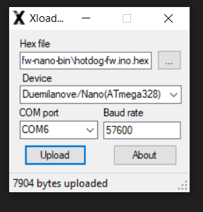

If you don't know which COM port the Nano is on, just try all of them.

Other Nano-compatible microcontrollers (Nano Every etc.):

Compile and upload [this sketch](https://github.com/Sauceke/hotdog/releases/latest/download/hotdog-fw.ino) using the [Arduino IDE](https://www.arduino.cc/en/software). The firmware depends on the following libraries:
- BTLE
- Protothreads
- RF24

### Soldering (front motherboard)
1. Put the 1x15 headers on the Nano. (I didn't have 1x15, so I cheated and yanked out one of the terminals from a 1x16. Don't be like me.)
> 

2. Solder the Nano to `A1` with its (mini/micro) USB connector facing towards the edge.
> 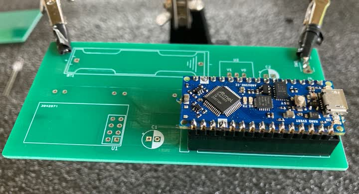 

3. Solder the photoresistors to `R1-R5` (opposite side of the motherboard).
> 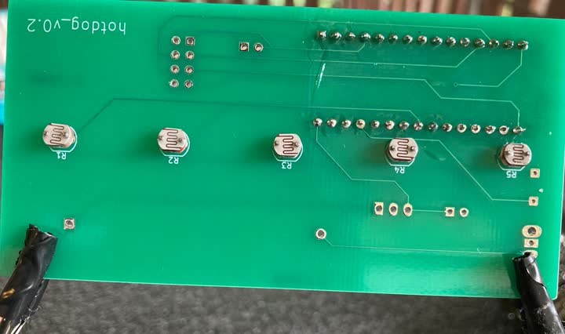

It is recommended to clip the wires before soldering to minimize heat loss. I prefer to also bend the wires before clipping them, so they won't fall out.
>  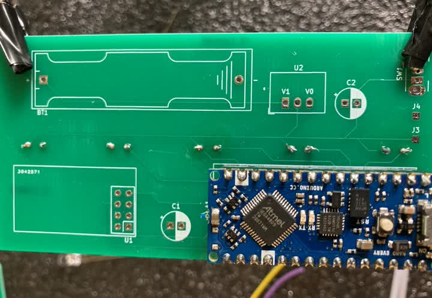

**If you're making the USB connected version, you're done here. Skip ahead to [the next section](#soldering-back-motherboard).**

4. Solder the 2x4 header to `U1`.
> 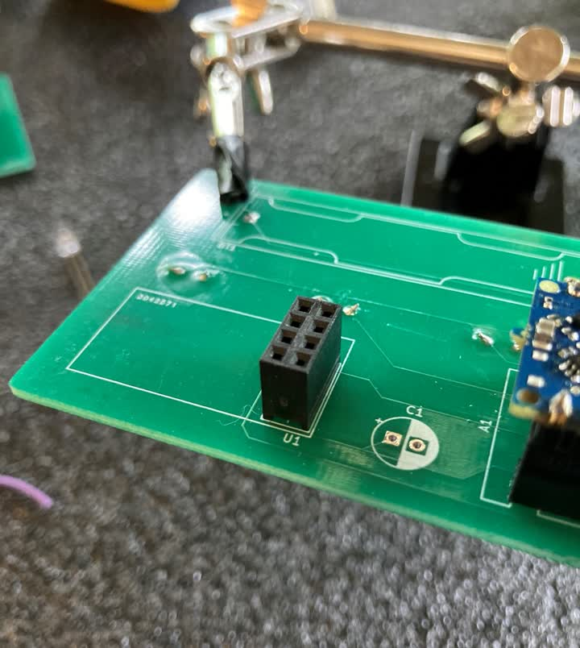 

5. Put the 1x3 female header on the boost converter and solder it to `U2`. Make sure V1 and V0 are aligned with the markings on the motherboard.
> 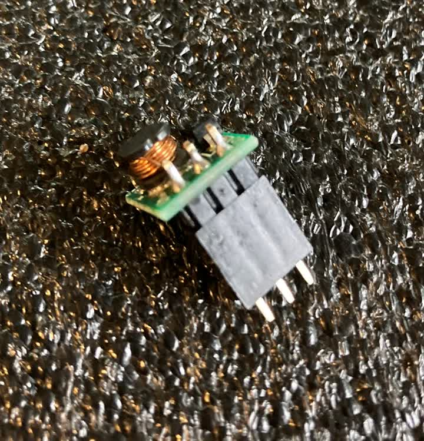 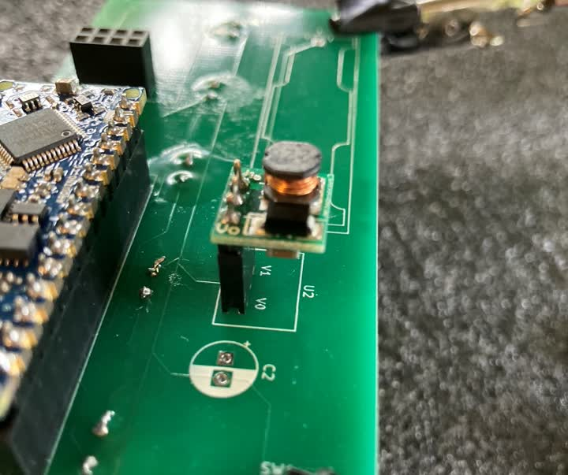

6. Solder a capacitor of about 1000uF to `C2`. Mind the polarity.
> 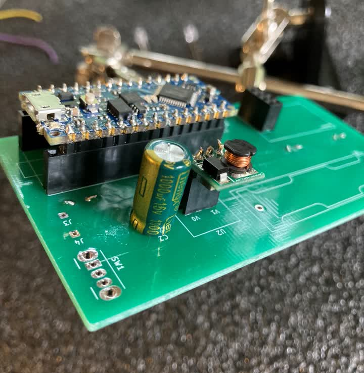 

7. Solder the SPDT switch to `SW1`. The terminals should go into the three holes in the middle. Mine was a bit oversized, but as they say, if there's a hole, there's a way.
>  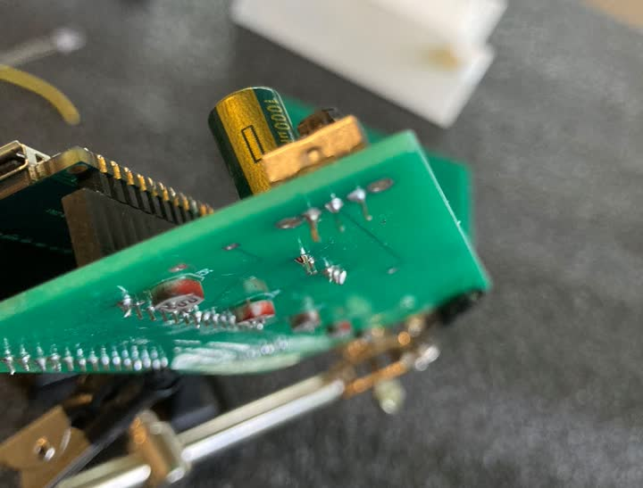

Words to live by indeed.

8. If you have a thru-hole mount 1xAAA battery holder, you can go ahead and solder it to `BT1` (mind the polarity) and skip to Step 13. If you're using a cheaper battery holder like I did, we need to take a few extra steps. This can get quite messy though, so in retrospect I absolutely recommend getting a proper thru-hole mount.

9. First, trim both wires to about 2cm, and put some deep scratches into the bottom with a sharp object. This is crucial to ensure proper bonding, so carve it up like a psycho.
> 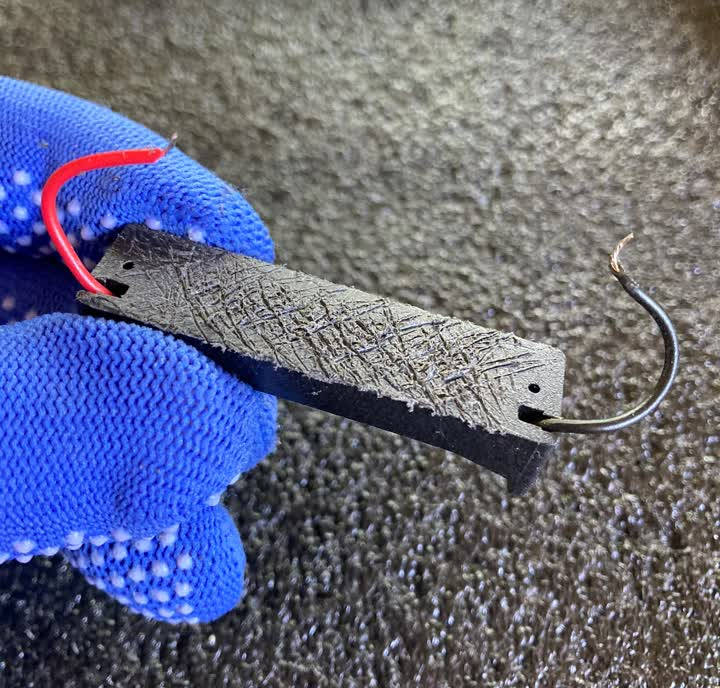

10. Then solder it to `BT1` in the correct polarity.
> 

11. Clean both the `BT1` footprint and the battery holder with isopropyl alcohol.

12. Glue the battery holder to `BT1` with epoxy. Make sure there is at least 5mm clearance between the battery holder and the edge of the motherboard.
> 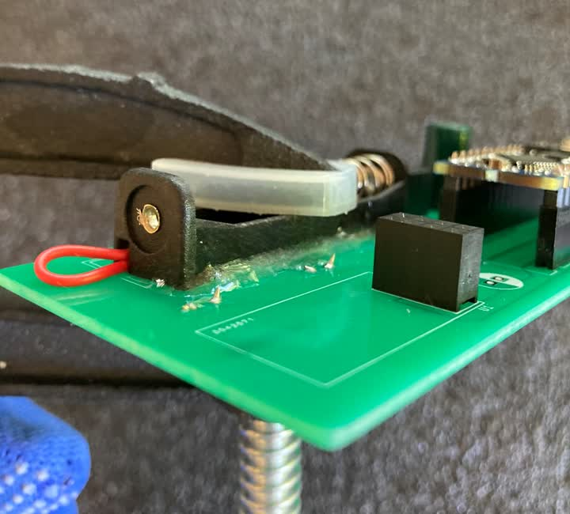 

Clamp it down and wait for the glue to dry. Meanwhile, you can start assembling the [back motherboard](#soldering-back-motherboard).

13. Solder a 100uF capacitor to `C1`.
> 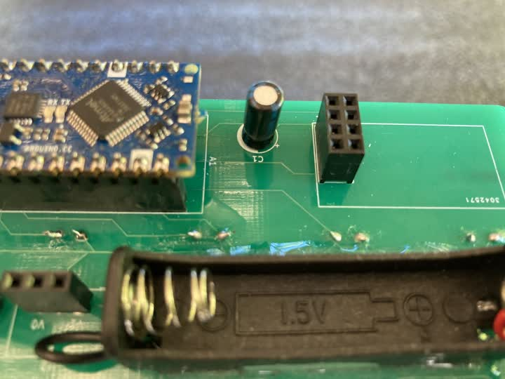

14. Insert the nRF24 into the `U1` socket, and that's the front motherboard done.
>  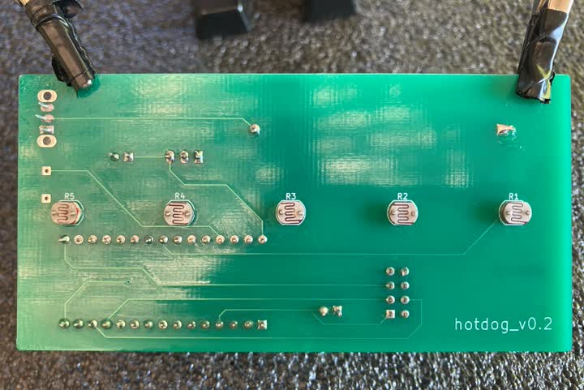

### Soldering (back motherboard)
1. Solder the LEDs to `D1-D3`. Pay attention to polarity; one of the sides on each LED is flattened, line that up with the drawing on the PCB.
> 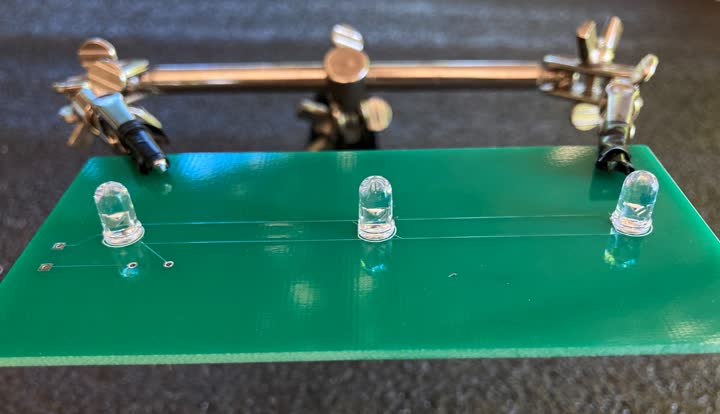 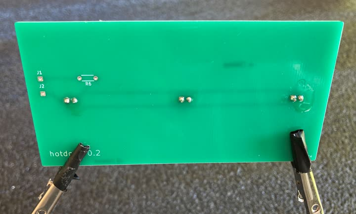
  
2. Solder a 1K resistor to `R6`.
> 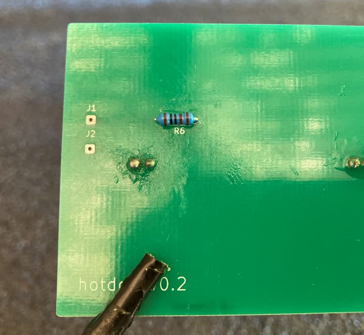

3. Connect `J1` to `J4` and `J2` to `J3` with 12cm long hook-up wires. Solder those in as well.
> 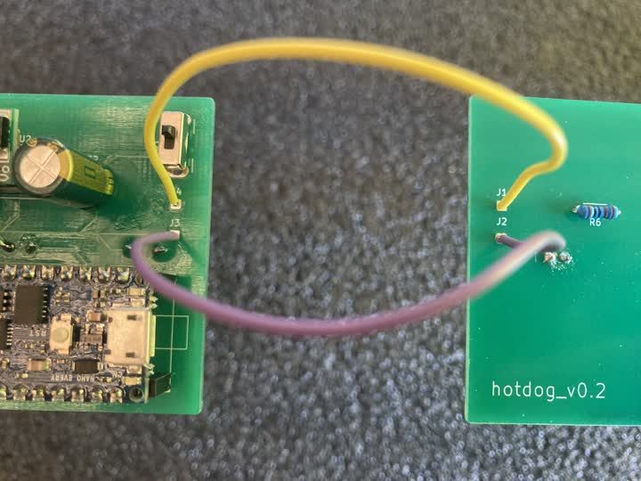

The motherboards are now complete.

> 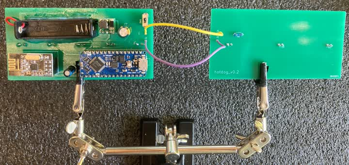

### Final assembly
1. Slide **hotdog-pcb-front** into **hotdog-case-top** and **hotdog-pcb-back** into **hotdog-case-bottom**. Make sure the LEDs and the photoresistors all face inwards (where the sleeve will be).
2. Secure each motherboard with a zip tie and the cut-off end of another zip tie.
3. Add the sleeve.
4. Bind the two parts of the casing together at their open ends with zip ties. Fasten the zip ties just tight enough that the casing won't separate from the sleeve.
5. Secure the other end of the casing to the sleeve with rubber bands.
6. Insert battery, power on and serve.

## Operation
In wireless mode, the Hotdog is powered by a single AAA battery. I recommend using a rechargeable one. It should last you about 2-3 hours on a single charge. There's no battery level indicator, so recharge frequently.

I'm still working on the client app for wireless, but it's already looking great. Stay tuned!
